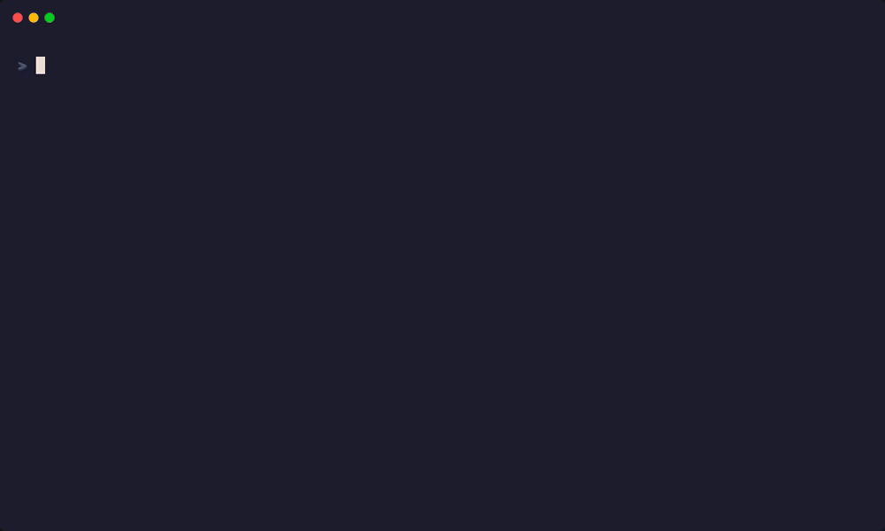
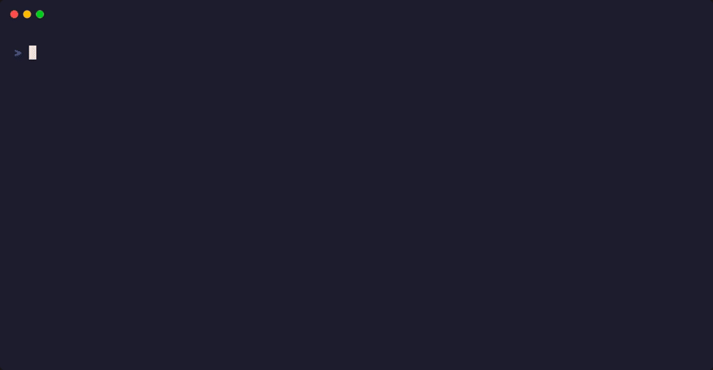
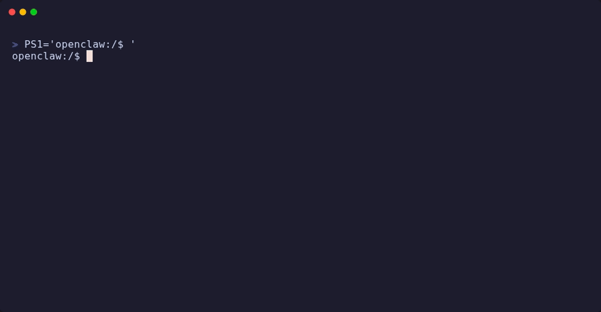

<h1 align="center">Your OpenClaw</h1>

<p align="center">
  <b>Self-host OpenClaw in one command. Own your AI.</b><br/>
  <sub>一条命令自托管 OpenClaw。你的 AI，你做主。</sub>
</p>

<p align="center">
  
</p>

<p align="center">
  <a href="#-quickstart">Quickstart</a> •
  <a href="#-demos">Demos</a> •
  <a href="#-whats-inside">What's Inside</a> •
  <a href="#-philosophy">Philosophy</a>
</p>

---

## 🧠 Philosophy

1. **🔒 Safety first.** Docker isolation → Tini signals → OpenClaw sandbox →
   Token auth → Device approval. Layers you can verify.
2. **🎉 Have fun, iterate fast, get your hands dirty.** `./shell` and you're in.
   Break things, fix things, learn things.
3. **✨ Keep it simple.** One command to start. Plain files on disk. No magic.

## ⚡ Quickstart

```bash
git clone https://github.com/congzhangzh/your_openclaw.git && cd your_openclaw
cp .env.example .env    # optional: tweak port / data path
./shell                 # builds, starts, attaches — done.
```

That's it. You're inside an OpenClaw container with everything pre-installed.\
The welcome screen tells you what to do next:

```bash
openclaw onboard              # first time: guided setup (API keys, model, channels)
openclaw gateway --verbose    # start the AI gateway
# Ctrl+P, Ctrl+Q             # detach — gateway keeps running in background
```

> **Come back anytime** — `docker attach openclaw` to re-attach.\
> **Data lives on your disk** — `~/.openclaw` is bind-mounted from the host.
> `ls`, `cp`, `rsync` — no black-box volumes.

---

## 🎬 Demos

> **Generate these GIFs:** run `vhs demos/<name>.tape` on a machine with Docker.

| Demo                                | What it shows                                 |
| ----------------------------------- | --------------------------------------------- |
|  | `./shell` → gateway → `Ctrl+P, Ctrl+Q` detach |

<!-- |  | `openclaw onboard` guided configuration       |
|    | `openclaw config get` / `set`                 |
|  | Add Telegram channel → approve device         | -->

---

## 📦 What's Inside

```
your_openclaw/
├── shell               ← one-command entry point (build + start + attach)
├── Dockerfile          ← Debian Trixie · Tini · Node 24 · OpenClaw
├── docker-compose.yml  ← ports, volumes, health check
├── .env.example        ← Docker-level config only (no secrets)
└── demos/              ← VHS tape files + generated GIFs
```

| Layer       | Detail                                                                                      |
| ----------- | ------------------------------------------------------------------------------------------- |
| **Base**    | `debian:trixie` — stable, full toolchain                                                    |
| **Init**    | [Tini](https://github.com/krallin/tini) as PID 1 — proper signal forwarding, zombie reaping |
| **Runtime** | Node 24 via NVM, `openclaw@latest`                                                          |
| **Tools**   | `btop` `nload` `iftop` `screen` `git` `curl` `iproute2` — monitor everything                |
| **Data**    | `~/.openclaw` on host ↔ `/root/.openclaw` in container                                      |

---

## 🔧 Inside the Container

`./shell` prints a cheat sheet on start. Here's the full reference:

### Setup

```bash
openclaw onboard                              # interactive guided setup
openclaw gateway --port 18789 --verbose       # start gateway (24/7)
```

### Channels & Devices

```bash
openclaw channel add telegram --botToken <token>
openclaw devices list
openclaw devices approve <request-id>
```

### Day-to-day

```bash
openclaw config get                # full config dump
openclaw config set <key> <value>  # change any setting
openclaw status                    # gateway health
openclaw logs                     # tail logs
openclaw version                  # current version
openclaw help                     # all commands
```

### Container management

```bash
docker attach openclaw             # attach to running gateway
# Ctrl+P, Ctrl+Q                  # detach (container keeps running)
docker exec -it openclaw bash      # open a second shell
docker logs -f openclaw            # stream logs from outside
```

### Update OpenClaw

```bash
docker exec -it openclaw npm install -g openclaw@latest
docker compose restart openclaw
```

---

## 🔐 VPS Disk Encryption + Compression

Your AI data deserves protection. We recommend encrypted + compressed
filesystems for VPS deployments.

### Option A: LVM (LUKS) + Btrfs with Compression (Recommended)

Battle-tested, widely supported. Transparent compression saves disk space on
logs and workspaces.

### Option B: ZFS on Root (Native Encryption — Use with Care)

Powerful but opinionated. See our guide:
[**ZFS on Debian**](https://github.com/congzhangzh/zfs-on-debian)

---

## 🌍 Recommended VPS Providers

Entry-level plans are more than enough for OpenClaw. Here's what we like:

> **Disclosure:** Links below are affiliate links. They help support this
> project at no extra cost to you.

### Hetzner Cloud

Rock-solid European infrastructure. Outstanding price-to-performance.

- **Pick:** CX22 (2 vCPU, 4 GB RAM, 40 GB) — plenty for OpenClaw
- **Location:** Helsinki (Finland) — clean energy, sustainable pricing long-term
- **Why we like it:** Stable performance, no billing surprises, 10 Gbps burst
  networking, cancel anytime

[**→ Get Started with Hetzner Cloud**](https://hetzner.cloud/?ref=QuqTJEEjeiIf)

### Servarica

Canadian provider with surprisingly good value on high-storage VPS plans.

- **Pick:** Any 4 GB RAM plan
- **Why we like it:** Clean IPs, generous storage, stable networking, Canadian
  hydroelectric energy = sustainable pricing

[**→ Get Started with Servarica**](https://clients.servarica.com/aff.php?aff=1238)

### Kuroit ⚠️

UK-based provider. Clean IPs. _We haven't used them long — proceed with your own
judgement._

- **Why it's here:** Clean IP reputation, competitive pricing
- **Caveat:** Relatively new to us — do your own due diligence

[**→ Get Started with Kuroit**](https://my.kuroit.com/aff.php?aff=447)

---

## 🔗 References

- [OpenClaw](https://github.com/nicepkg/openclaw) — the AI gateway
- [MiniMax × OpenClaw](https://platform.minimax.io/docs/coding-plan/openclaw) —
  MiniMax integration guide
- [ZAI Models (HuggingFace)](https://huggingface.co/zai-org)
- [MiniMax (HuggingFace)](https://huggingface.co/MiniMaxAI)
- [Lark / 飞书](https://www.larksuite.com/)

---

## 📄 License

MIT

---

<p align="center"><sub>Built with care. Deploy with confidence. <b>Your AI, your rules.</b></sub></p>
